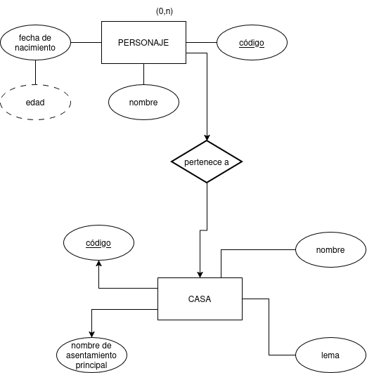
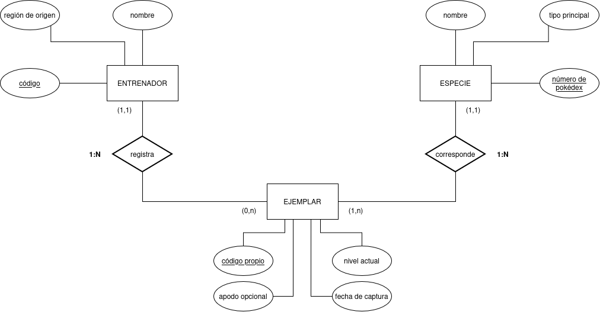

# ACTIVIDAD 1 MODELOS E/R

## EJERCICIO 1

### *ENTIDADES Y ATRIBUTOS*

**PERSONAJE** *Código, nombre, fecha de nacimiento, título nobiliario*

**CASA:**  *Código, nombre, lema, nombre del asentamiento principal*

## EJERCICIO 2

### *ENTIDADES Y ATRIBUTOS*

**ENTRENADOR** *Código, nombre, región de origen*

**EJEMPLAR** *Código propio, nivel actual, mote (opcional), fecha de captura*

**ESPECIE** *Nombre, tipo principal, número de pokedex*

